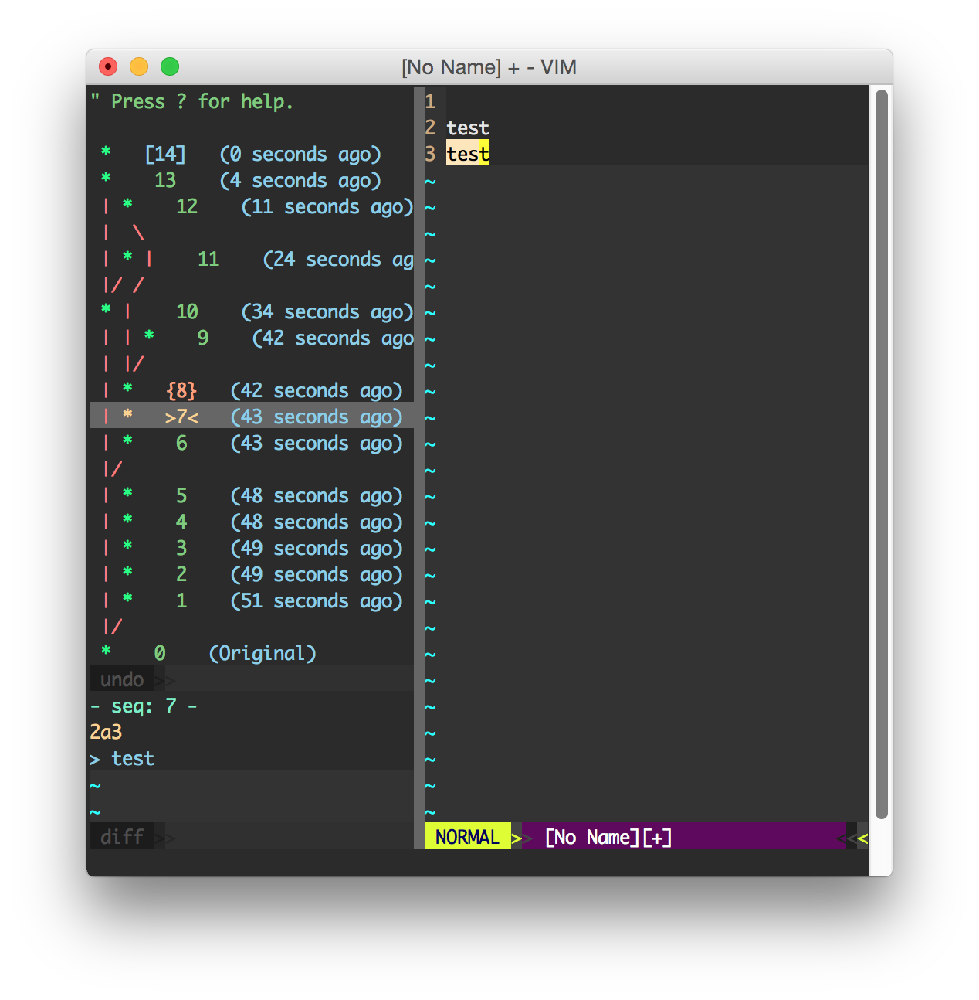

### [Project on Vim.org](http://www.vim.org/scripts/script.php?script_id=4177)

[](https://gitter.im/mbbill/undotree?utm_source=badge&utm_medium=badge&utm_campaign=pr-badge&utm_content=badge)

### Screenshot



### Table of Contents

<!-- TOC -->

- [Description](#description)
- [Download and Install](#download-and-install)
- [Usage](#usage)
    - [Configuration](#configuration)
    - [Debug](#debug)
- [License](#license)
- [Author](#author)

<!-- /TOC -->

### Description

Undotree visualizes the undo history and makes it easy to browse and switch between different undo branches. You may be wondering, _what are undo "branches" anyway?_ They're a feature of Vim that allow you to go back to a prior state even after it has been overwritten by the latest edit. For example: In most editors, if you make some change A, followed by change B, then go back to A and make another change C, normally you wouldn't be able to go back to change B because the undo history is linear. That's not the case with Vim however. Vim internally stores the entire edit history as a single, monolithic tree structure; this plug-in exposes that tree to you so that you can not only switch back and forth between older and more recent edits, but can also switch between diverging branches.


Some people have questions about file contents being changed when switching between undo history states. Don't worry, *undotree* will **NEVER** save your data or write to disk. All it does is to change the current buffer a little bit, just like those auto-completion plug-ins do. It just adds or removes something in the buffer temporarily, and if you don't like you can always go back to the last state easily. Let's say, you made some change but didn't save it, then you use *undotree* and go back to an arbitrary version, your unsaved change doesn't get lost - it stores in the latest undo history node. Clicking that node on *undotree* will bring you back instantly. Play with undo/redo on other editors is always dangerous because when you step back and accidentally typed something, boom! You lose your edits. But don't worry, that won't happen in Vim. Then you might ask what if I make some changes without saving and switch back to an old version and then **exit**? Well, imagine what would happen if you don't have *undotree*? You lose your latest edits and the file on disk is your last saved version. This behavior **remains the same** with *undotree*. So, if you saved, you won't lose anything.


We all know that usually undo/redo is only for the current edit session. It's stored in memory and once the process exits, the undo history is lost. Although *undotree* makes switching between history states easier, it doesn't do more than that. Sometimes it would be much safer or more convenient to keep the undo history across edit sessions. In this case, you might need to enable a Vim feature called *persistent undo*. Let me explain how persistent undo works: instead of keeping undo history in *RAM*, persistent undo keeps undo history in a file. Let's say you make a change A, followed by B, then go back to A and make another change C, then you *save* the file. Now Vim save the file with content state C, and in the meantime it saves **the entire** undo history to a file including state A, B and C. Next time when you open the file, Vim will also restore undo history. So you can still go back to B. The history file is incremental, and every change will be recorded permanently, kind of like Git. You might think that's too much, well, *undotree* does provide a way to clean them up. If you need to enable *persistent undo*, type ```:h persistent-undo``` or follow the instructions below.


Undotree is written in **pure Vim script** and doesn't rely on any third-party tools. It's lightweight, simple, and fast. It only does what it's supposed to do, and it only runs when you need it.


### Download and Install

Using Vim's built-in package manager:

```sh
mkdir -p ~/.vim/pack/mbbill/start
cd ~/.vim/pack/mbbill/start
git clone https://github.com/mbbill/undotree.git
vim -u NONE -c "helptags undotree/doc" -c q
```

Use whatever plug-in manager to pull the master branch. I've included 2 examples of the most used:

- *Vundle:* `Plugin 'mbbill/undotree'`
- *Vim-Plug:* `Plug 'mbbill/undotree'`

And install them with the following:

- *Vundle:* `:PluginInstall`
- *Vim-Plug:* `:PlugInstall`

### Usage

  1. Use `:UndotreeToggle` to toggle the undo-tree panel. You may want to map this command to whatever hotkey by adding the following line to your vimrc, take `F5` for example.

```vim
nnoremap <F5> :UndotreeToggle<CR>
```

  1. Markers
     * Every change has a sequence number and it is displayed before timestamps.
     * The current state is marked as `> number <`.
     * The next state which will be restored by `:redo` or `<ctrl-r>` is marked as `{ number }`.
     * The `[ number ]` marks the most recent change.
     * The undo history is sorted by timestamps.
     * Saved changes are marked as `s` and the big `S` indicates the most recent saved change.
  2. Press `?` in undotree window for quick help.
  3. Persistent undo
     * Usually, I would like to store the undo files in a separate place like below.

```vim
if has("persistent_undo")
   let target_path = expand('~/.undodir')

    " create the directory and any parent directories
    " if the location does not exist.
    if !isdirectory(target_path)
        call mkdir(target_path, "p", 0700)
    endif

    let &undodir=target_path
    set undofile
endif
```

#### Configuration

[Here](https://github.com/mbbill/undotree/blob/master/plugin/undotree.vim#L15) is a list of options.

#### Debug

  1. Create a file under $HOME with the name `undotree_debug.log`
     * `$touch ~/undotree_debug.log`
  2. Run vim, and the log will automatically be appended to the file, and you may watch it using `tail`:
     * `$tail -F ~/undotree_debug.log`
  3. If you want to disable debug, just delete that file.

### License

**BSD**

### Author

Ming Bai  &lt;mbbill AT gmail DOT COM&gt;
